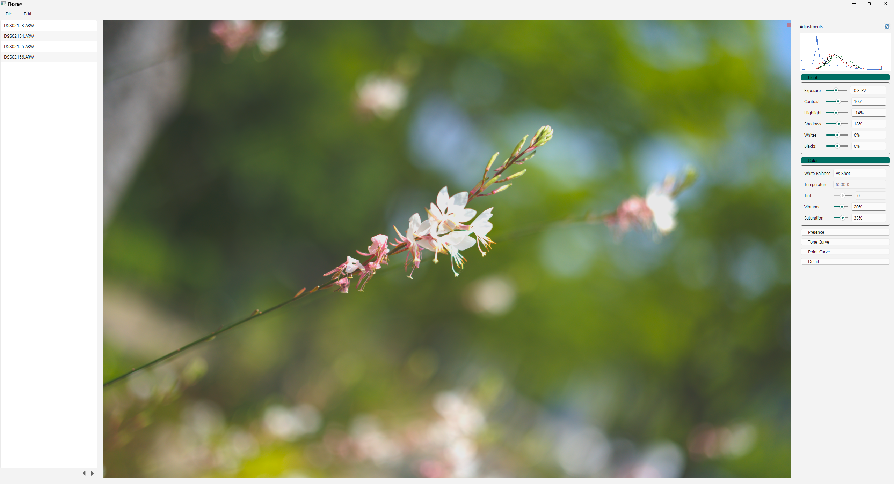

# FlexRAW

FlexRAW는 로컬 환경에서 RAW 사진을 보정하고, 필요한 경우 별도의 Worker로 내보내기 작업을 나눠 처리할 수 있는
RAW 이미지 보정 프로그램입니다. Desktop 모드에서는 SQLite 기반 카탈로그, 비파괴 보정, 프리뷰와 단일/그룹
내보내기를 지원합니다. 내보내기는 Local, Remote 또는 Auto 방식으로 실행할 수 있습니다.
CPU 사용량은 현재 4코어 고정이며, 추후 지원할 예정입니다.



## 주요 기능

- 원본 파일을 직접 수정하지 않고 보정값과 사진 identity를 카탈로그에 저장합니다.
- 노출, 대비, 하이라이트/그림자, White Balance, 채도, 명료도, 디헤이즈, 날카롭게 하기, 노이즈 감소와 톤 커브를
  조정할 수 있습니다.
- 연속된 조작에서는 빠른 interactive preview를 사용하고, 조작이 끝나면 final preview를 다시 생성합니다.
- JPEG, PNG, TIFF 형식의 단일, 다중 선택과 folder batch 내보내기를 지원합니다.
- Local/Remote/Auto placement를 이용해 Desktop과 별도 Worker의 여유 slot에 내보내기 작업을 배치합니다.
- Worker는 bounded queue, cancellation, backpressure와 실행 전 resource admission을 사용합니다.

## 현재 상태

현재 버전은 `0.1.0`입니다. Desktop은 Windows x64를 우선 지원하며, 워커는 Windows x64, Linux x64와
Jetson ARM64에서 native build와 실제 RAW end-to-end 경로를 확인했습니다.

Remote 내보내기는 RAW나 결과물을 TCP로 전송하는 방식이 아니라 Desktop과 Worker가 함께 접근할 수 있는 네트워크 스토리지 연결을 필요로 합니다.
그래서 현재 프로토콜에는 TLS와 인증/인가가 없기 때문에 loopback 또는 신뢰할 수 있는 내부
네트워크에서만 사용하는 것을 전제로 합니다. 프로젝트 폴더, 고급 색 관리, frame/watermark를 포함한 일부 기능은 아직 개발 중입니다.

## 빌드

공개 프리셋은 Visual Studio 2022와 vcpkg manifest mode로 윈도우 데스크탑 실행파일을 빌드합니다.
Visual Studio의 `Desktop development with C++` workload, CMake 3.25 이상과 vcpkg를 설치한 뒤,
`VCPKG_ROOT`를 vcpkg 설치 디렉터리로 설정해주세요.

```powershell
cmake --preset windows-msvc-release
cmake --build --preset release
ctest --preset release
```

배포 가능한 application은 `build/release/Release/flexraw.exe`에 생성됩니다. 기본 공개 preset은 Render Worker와
benchmark executable을 build하지 않으며, 이 target들은 명시적인 CMake option으로 사용할 수 있습니다.

## 빠른 사용

`flexraw.exe`를 실행한 뒤 `File` 메뉴에서 카탈로그나 folder를 열고 사진을 선택합니다. 오른쪽 panel에서 보정값을
조정한 뒤 `Export`에서 출력 형식과 Local/Remote/Auto 실행 방식을 선택할 수 있습니다.

`Ctrl+Alt+C`를 누르면 앱 내부 Console Mode로 전환됩니다. 아래 명령은 PowerShell이 아니라 Console Mode 입력창에서
사용합니다.

```text
diagnose raw --input "C:\Photos\sample.ARW"
```

```text
export raw --input "C:\Photos\sample.ARW" --output "C:\Exports\sample.jpg" --format jpeg --quality 95 --color-space srgb --metadata exclude
```

```text
export batch --input-folder "C:\Photos" --output-folder "C:\Exports" --format jpeg --quality 95 --workers 4 --metadata exclude
```

사용 가능한 명령 목록은 `help`, graphical UI로 돌아갈 때는 `gui`를 입력합니다. Console Mode의 내보내기는 현재
Local 실행만 지원합니다.

## Worker 모드

기본 public 프리셋은 Desktop만 build합니다. Windows Worker-only build가 필요한 경우 다음처럼 별도 build directory를
사용할 수 있습니다.

```powershell
cmake -S . -B build/worker/windows-release `
  -G "Visual Studio 17 2022" -A x64 `
  -DCMAKE_TOOLCHAIN_FILE="$env:VCPKG_ROOT/scripts/buildsystems/vcpkg.cmake" `
  -DFLEXRAW_BUILD_DESKTOP=OFF `
  -DFLEXRAW_BUILD_WORKER=ON `
  -DFLEXRAW_BUILD_TESTS=ON `
  -DFLEXRAW_BUILD_UI_TESTS=OFF `
  -DVCPKG_MANIFEST_NO_DEFAULT_FEATURES=ON `
  -DVCPKG_MANIFEST_FEATURES=tests

cmake --build build/worker/windows-release --config Release --parallel
ctest --test-dir build/worker/windows-release -C Release --output-on-failure
```

Worker는 source/output root가 이미 존재해야 하며, 다음은 안전한 loopback 실행 예시입니다.

```powershell
.\build\worker\windows-release\Release\flexraw-worker.exe `
  --source-root "C:\FlexRAW\Shared\Originals" `
  --output-root "C:\FlexRAW\Shared\Exports" `
  --listen-address 127.0.0.1 `
  --port 47331 `
  --concurrency 2 `
  --queue-capacity 4
```

다른 장치의 Worker를 사용할 때는 두 장치에서 같은 상대경로를 가리키도록 storage를 mount해야 합니다. Desktop은
`.flexraw-storage.json` marker로 storage identity를 확인하고, wire에는 portable relative path만 전달합니다. 현재
Worker는 manual endpoint 방식이며 LAN discovery나 Internet 공개를 위한 security 기능은 포함하지 않습니다.

## 구조

Desktop, 카탈로그/편집기/프리뷰, 내보내기 배치, 원격 렌더링(네트워크 스토리지 한정), 서버 런타임,
스레딩과 CMake target 경계는 [`architecture.md`](architecture.md)에서 설명합니다.

## License

파일이나 디렉터리에 별도 표시가 없는 한, 이 미러에서 공개되는 FlexRAW 소스에는
**GNU Affero General Public License, version 3 or any later version**
(`AGPL-3.0-or-later`)이 적용된다. GNU AGPL v3 전문은 [`LICENSE`](LICENSE)에 있다.

서드파티 라이브러리, 도구, 데이터, 플러그인과 모델 출력물에는 각각의 라이센스가 유지된다. FlexRAW 프로젝트 라이센스는
이들의 라이센스 조건을 변경하거나 대체하지 않는다. 검토를 거친 의존성 목록은
[`THIRD_PARTY_LICENSES.md`](THIRD_PARTY_LICENSES.md)에서 확인할 수 있습니다.

## 별도 상업 라이센스

저작권자는 FlexRAW가 소유한 코드를 별도의 private/commercial license로 제공할 수 있다. 이 공개 repository는
위에 명시된 AGPL 권리만 부여하며 상업 조건을 부여하지 않습니다.

별도 상업 라이센싱은 third-party license를 변경하지 않습니다. 특히 proprietary 배포 build는 실제 upstream
허가를 독립적으로 확인하지 못한 경우 Exiv2를 교체하거나 제외해야 하며, 해당 product에 유효한 Qt licensing 경로
하나를 선택해야 합니다.

## 공개 바운더리

- 비공개 이력, credential, 로컬 경로, 비공개 테스트 사진이나 접근이 제한된 asset을 복사하지 않는다.
- 변경 중인 working tree를 복사하지 않고 검토된 단일 commit에서 source를 공개한다.
- 정확한 release profile과 final package를 기준으로 binary notice bundle을 다시 생성한다.
- 모든 public binary release에 완전한 Corresponding Source와 source 접근 정보를 포함한다.
- Exiv2는 직접 link되는 `GPL-2.0-or-later` dependency다. 공개 FlexRAW build는 AGPLv3 application과 호환되는
  GPLv3 경로를 사용하며, Exiv2 자체에는 기존 license가 그대로 유지된다.


---

## License (English)

Unless a file or directory states otherwise, FlexRAW source published in this mirror is licensed under
the **GNU Affero General Public License, version 3 or any later version**
(`AGPL-3.0-or-later`). The full GNU AGPL v3 text is in [`LICENSE`](LICENSE).

Third-party libraries, tools, data, plugins, and model artifacts retain their own licenses. FlexRAW's
project license does not relicense them. See
[`THIRD_PARTY_LICENSES.md`](THIRD_PARTY_LICENSES.md) for the audited dependency inventory.

### Separate Commercial Licensing

The copyright holders may offer FlexRAW-owned code under a separate private/commercial license. This
public repository grants only the AGPL rights stated above; it does not grant commercial terms.

Separate commercial licensing does not change third-party licenses. In particular, a proprietary
distributed build must replace or exclude Exiv2 unless an actual upstream grant is independently
verified, and must select one valid Qt licensing path for that product.

### Publication Boundary

- Do not copy private history, credentials, local paths, private test photographs, or controlled assets.
- Publish source from one reviewed commit rather than copying a changing working tree.
- Regenerate the binary notice bundle from the exact release profile and final package.
- Include complete corresponding source and source-access information for every public binary release.
- Exiv2 is a directly linked `GPL-2.0-or-later` dependency. Public FlexRAW builds use its GPLv3-compatible
  route with the AGPLv3 application; Exiv2 itself remains under its own license.
