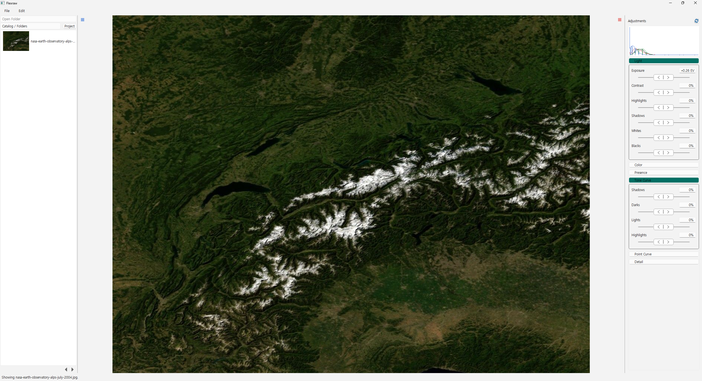

# FlexRAW

FlexRAW는 로컬 환경에서 RAW 사진을 관리하고 비파괴 보정과 내보내기를 수행하는 C++20 기반 사진 편집기입니다.
Windows Desktop을 우선 지원하며, 동일한 processing path를 사용하는 별도 Render Worker와 local STDIO MCP consumer도
함께 제공합니다.

> 현재 버전: **0.1.0-alpha.5**
> 현재 checkpoint: **M1.7 Local Product Acceptance & Freeze 완료**

현재 공개본은 기본 workflow와 architecture boundary를 검토할 수 있는 source snapshot입니다. 완성된 상용 사진 보정
제품이나 모든 camera·운영체제를 지원하는 배포판을 의미하지는 않습니다.



*Windows Release Editor에서 Relative adjustment control로 Exposure를 보정한 화면입니다. 표시 image는
[NASA Earth Observatory의 Blue Marble: Next Generation — Alps, July 2004](https://science.nasa.gov/earth/earth-observatory/blue-marble-next-generation/)이며,
NASA Earth Observatory를 출처로 표시합니다. NASA의
[Images and Media Usage Guidelines](https://www.nasa.gov/nasa-brand-center/images-and-media/)를 따릅니다.*

## 현재 제공하는 기능

- folder에서 RAW와 JPEG/PNG/TIFF 사진을 찾아 Catalog에 등록하고 bounded page로 탐색할 수 있습니다.
- embedded thumbnail을 먼저 표시한 뒤 standard preview로 교체하며, visible/adjacent 범위만 thumbnail로 유지합니다.
- exposure, contrast, highlights, shadows, whites, blacks, white balance, vibrance, saturation을 조정할 수 있습니다.
- clarity, dehaze, sharpening, luminance/color noise reduction과 parametric/point tone curve를 지원합니다.
- 사진별 undo/redo, 연속 조작 coalescing, persisted revision과 explicit save를 지원합니다.
- Project 생성·이름 변경·삭제와 multi-selection membership 추가·제거를 지원합니다.
- missing/replacement source를 확인하고 replacement 수용, 새 Photo 등록 또는 relink를 수행할 수 있습니다.
- JPEG/PNG/TIFF Export에서 크기, output color space, metadata와 atomic write를 지원합니다.
- Local/Remote/Auto placement, progress, cancellation과 exact terminal을 제공합니다.
- application-level Worker profile, one-shot health 확인과 Export 기본값을 Settings에서 관리할 수 있습니다.
- Classic slider와 중앙 복귀형 Relative rate control을 모든 숫자 보정 항목에서 선택할 수 있습니다.

## 실행 구성

| 실행 파일 | 역할 | 현재 범위 |
|---|---|---|
| `flexraw.exe` | Qt Widgets Desktop | Windows가 primary 검증 대상입니다. |
| `flexraw-mcp.exe` | local STDIO MCP consumer | bounded Catalog/Project read와 opt-in write tool을 제공합니다. |
| `flexraw-worker` | TCP Render Worker | Windows, WSL x64와 Jetson ARM64에서 build 및 RAW E2E를 확인했습니다. |

Desktop과 MCP는 같은 Qt-free Product Contract와 `ProductRuntime` owner type을 사용하지만 현재는 별도 process로 실행됩니다.
Worker는 Product Contract가 아니라 server-facing Runtime port와 versioned wire protocol을 사용합니다.

## Architecture 요약

```text
Qt Desktop                         Local STDIO MCP
MainWindow + Qt Adapter            MCP Adapter
        |                              |
        +------ Qt-free Product Contract ------+
                         ^
                         |
              Product Runtime (현재 Qt-based)
              Catalog / Editor authority
                         |
             Orchestration -> domain modules
          catalog / raw / develop / color / preview / export

Render Worker
TCP Server Adapter -> Worker Runtime port -> bounded Worker Runtime
                                             |
                                      resolved render pipeline
```

Adapter는 business state를 복제하지 않으며, concrete object graph와 lifetime은 각 executable의 Composition Root가
소유합니다. Preview와 Export는 서로 다른 lifecycle을 사용하지만 RAW decode, develop, color와 encode 의미를 공유합니다.
자세한 내용은 [architecture.md](architecture.md)를 참고해 주세요.

## 현재 지원하지 않는 범위

다음 기능은 아직 구현 또는 제품 검증 범위에 포함되지 않습니다.

- automatic save와 disk thumbnail cache
- crop/rotate/straighten, HSL/color grading, local mask와 layer
- monitor별 display ICC와 full-resolution precision editing tier
- Lensfun correction, HDR/panorama와 ML inference
- Worker discovery, multi-worker scheduling, authentication/TLS와 public Internet 운영
- Linux/macOS Desktop frontend와 GUI+MCP combined executable
- 독립 installable processing engine package

미구현 기능을 directory 이름이나 placeholder만으로 지원한다고 주장하지 않습니다. 실제 구현 범위와 다음 개발 gate는
[ROADMAP.md](ROADMAP.md)를 참고해 주세요.

## Build

Windows에서는 Visual Studio 2022, CMake 3.25 이상과 vcpkg가 필요합니다. `VCPKG_ROOT`를 vcpkg 설치 directory로
설정한 뒤 다음 명령을 사용할 수 있습니다.

```powershell
.\scripts\build-msvc.ps1 -Configuration Release -Test
```

동일한 동작을 CMake 명령으로 실행하려면 다음과 같이 진행해 주세요.

```powershell
cmake --preset windows-msvc-release
cmake --build --preset release --config Release --parallel 8 -- /nr:false
ctest --preset release --parallel 8
```

Release Desktop 실행 파일은 기본적으로 다음 위치에 생성됩니다.

```text
build/release/Release/flexraw.exe
```

첫 configure에서는 vcpkg dependency build 때문에 시간이 오래 걸릴 수 있습니다. Worker, MCP-only, portable contract와
benchmark용 preset은 [CMakePresets.json](CMakePresets.json)에서 확인할 수 있습니다.

## 사진과 개인정보

FlexRAW에는 사진, metadata 또는 Catalog 정보를 개발자 운영 서버로 전송하는 telemetry나 upload 기능이 없습니다.
Local Desktop과 MCP에서 사용하는 사진 정보는 사용자의 장치에 머무르며 개발자에게 전송되지 않습니다.

Remote Export를 명시적으로 설정한 경우에는 사용자가 직접 지정한 Worker와만 통신합니다. 이 경로 역시 FlexRAW 개발자에게
사진 정보를 전송하지 않으며, 현재 Worker는 loopback 또는 사용자가 관리하는 신뢰할 수 있는 내부 network에서만 사용해야
합니다.

## Worker 사용 범위

Remote Export는 RAW byte를 TCP로 업로드하거나 결과물을 다운로드하지 않습니다. Desktop과 Worker가 같은 logical storage를
각자의 local path로 mount한 trusted environment를 전제로 합니다. Wire에는 storage root 기준의 portable relative path만
전달합니다.

현재 protocol에는 authentication과 TLS가 없으므로 loopback 또는 신뢰할 수 있는 내부 network에서만 사용해 주세요.
Internet에 직접 노출해서는 안 됩니다.

## MCP 사용 범위

MCP는 explicit Catalog 하나를 열어 bounded Catalog/Project read, Editor state 조회와 Source Resolution event poll을
제공합니다. Project membership 변경, Editor 선택·Exposure 변경과 Source Resolution 취소는 process startup에서
`--allow-write`를 지정한 경우에만 광고합니다.

Preview frame, Export, Worker 제어와 generic filesystem access는 현재 MCP tool surface에 포함되지 않습니다.

## 공개 source 경계

- 검토된 하나의 source commit을 기준으로 공개합니다.
- credential, 개인 local path, private RAW와 재배포 권리가 없는 asset은 포함하지 않습니다.
- Binary release는 source 공개와 별도로 clean staging artifact와 third-party notice를 다시 검증해야 합니다.
- 공개 screenshot은 NASA Earth Observatory image를 사용하며 원본 image file은 repository에 포함하지 않습니다.

## License

별도 표시가 없는 FlexRAW 소스에는 **GNU Affero General Public License, version 3 or any later version**
(`AGPL-3.0-or-later`)이 적용됩니다. GNU AGPL v3 전문은 [LICENSE](LICENSE)에서 확인할 수 있습니다.

Third-party library, tool, data와 model artifact에는 각각의 license가 유지됩니다. 자세한 dependency inventory는
[THIRD_PARTY_LICENSES.md](THIRD_PARTY_LICENSES.md)를 확인해 주세요.

저작권자는 FlexRAW가 소유한 code를 별도의 private/commercial license로 제공할 수 있습니다. 이 repository는 위에 명시한
AGPL 권리만 부여하며 별도의 commercial 조건을 부여하지 않습니다.
