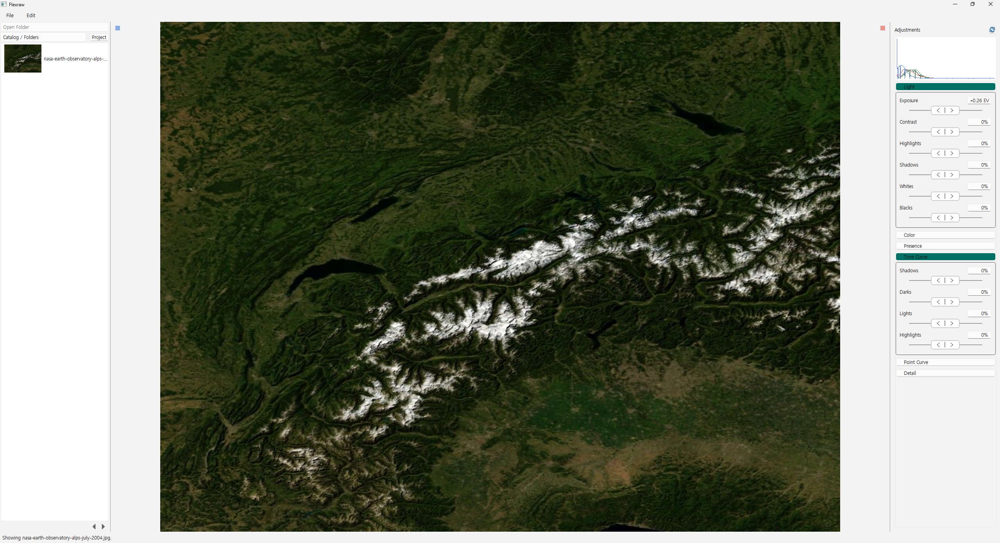

# FlexRAW

FlexRAW는 로컬 환경에서 RAW 사진을 관리하고 비파괴 보정과 내보내기를 수행하는 C++20 기반 사진 편집기입니다.
Windows 데스크톱을 우선 지원하며, 동일한 처리 경로를 사용하는 별도 Render Worker와 로컬 STDIO MCP 서버도
함께 제공합니다.

> 현재 버전: **0.2.0-alpha.1**
> 현재 체크포인트: **M1.7 Local Product Acceptance & Freeze 완료**

현재 공개본은 기본 워크플로우와 구조를 검토할 수 있는 소스 스냅샷입니다.



*Windows 릴리스 편집기에서 `Relative` 조정 컨트롤로 `Exposure`를 보정한 화면입니다. 표시된 이미지는
[NASA Earth Observatory의 Blue Marble: Next Generation — Alps, July 2004](https://science.nasa.gov/earth/earth-observatory/blue-marble-next-generation/)이며,
NASA Earth Observatory를 출처로 표시합니다. NASA의
[Images and Media Usage Guidelines](https://www.nasa.gov/nasa-brand-center/images-and-media/)를 따릅니다.*

## 현재 제공하는 기능

- 폴더에서 RAW와 JPEG/PNG/TIFF 사진을 찾아 카탈로그에 등록하고 페이지 단위로 탐색할 수 있습니다.
- 화면에는 내장 썸네일을 먼저 표시한 뒤 표준 프리뷰로 교체하며, 현재 보이는 항목과 인접 항목의 썸네일만 유지합니다.
- 노출, 대비, 밝은 영역, 어두운 영역, 흰색 영역, 검은색 영역, 화이트밸런스, 생동감, 채도를 조정할 수 있습니다.
- 명료도, 디헤이즈, 샤프닝, 휘도/색상 노이즈 감소와 파라메트릭/포인트 톤 커브를 지원합니다.
- 사진별 실행 취소/다시 실행, 연속 조작의 실행 이력 병합, 영구 저장되는 리비전과 명시적 저장을 지원합니다.
- 프로젝트 생성·이름 변경·삭제와 여러 사진을 한 번에 프로젝트에 추가하거나 제거하는 기능을 지원합니다.
- 누락되거나 교체된 원본을 확인하고, 교체본 수용·새 사진 등록·원본 다시 연결을 수행할 수 있습니다.
- JPEG/PNG/TIFF 내보내기에서 크기, 출력 색 공간과 메타데이터를 설정하며 파일을 원자적으로 기록합니다.
- `Local`/`Remote`/`Auto` 작업 배치와 진행 상태·취소를 지원하며, 종료 결과는 정확히 한 번만 확정합니다.
- 애플리케이션 단위의 Worker 프로필, 일회성 상태 확인과 내보내기 기본값을 설정에서 관리할 수 있습니다.
- `Classic` 슬라이더와 중앙 복귀형 `Relative` 조정 컨트롤을 모든 숫자 보정 항목에서 선택할 수 있습니다.

## 실행 구성

| 실행 파일 | 역할 | 현재 범위 |
|---|---|---|
| `flexraw.exe` | Qt Widgets 데스크톱 | Windows가 우선 검증 대상입니다. |
| `flexraw-mcp.exe` | 로컬 STDIO MCP 서버 | 범위가 제한된 `Catalog`/`Project` 읽기와 선택적으로 활성화하는 쓰기 도구를 제공합니다. |
| `flexraw-worker` | TCP Render Worker | Windows, WSL x64와 Linux ARM64에서 빌드 및 RAW E2E를 확인했습니다. |

Desktop과 MCP는 같은 `Qt-free Product Contract`와 `ProductRuntime` 소유자 타입을 사용하지만 현재는 별도 프로세스로 실행됩니다.
Worker는 `Product Contract`가 아니라 서버 측 `Runtime` 포트와 버전이 명시된 와이어 프로토콜을 사용합니다.

Linux ARM64는 운영체제와 아키텍처를 나타내는 명칭이며 Ubuntu나 특정 제조사 장비 전용 대상이 아닙니다.
검증한 환경의 빌드/E2E 결과를 의미하며, 모든 Linux 배포판과 ARM64 장비의 호환성을 보장하지는 않습니다.

## 아키텍처 요약

```text
Qt Desktop                              Local STDIO MCP
MainWindow + Qt Adapter                   MCP Adapter
        |                                      |
        +------ Qt-free Product Contract ------+
                         ^
                         |
              Product Runtime (현재 Qt-based)
              Catalog / Editor authority
                         |
             Orchestration -> domain modules
          catalog / raw / develop / color / preview / export

Render Worker
TCP Server Adapter -> Worker Runtime port -> bounded Worker Runtime
                                             |
                                      resolved render pipeline
```

어댑터는 도메인 상태를 복제하지 않으며, 구체 객체 그래프와 수명은 각 실행 파일의 `Composition Root`가
소유합니다. 프리뷰와 내보내기는 서로 다른 수명 주기를 사용하지만 RAW 디코딩, 현상, 색 처리와 인코딩 의미를 공유합니다.
자세한 내용은 [architecture.md](architecture.md)를 참고해 주세요.

## 현재 지원하지 않는 범위

다음 기능은 아직 구현 또는 제품 검증 범위에 포함되지 않습니다.

- 자동 저장과 디스크 썸네일 캐시
- 자르기/회전/수평 맞추기, HSL/컬러 그레이딩, 로컬 마스크와 레이어
- 모니터별 디스플레이 ICC와 전체 해상도 정밀 편집 단계
- Lensfun 보정, HDR/파노라마와 ML 추론
- Worker 자동 탐색, 다중 Worker 스케줄링, 인증/TLS와 공개 인터넷 운영
- Linux/macOS 데스크톱 프런트엔드와 GUI+MCP 통합 실행 파일
- 독립 설치형 처리 엔진 패키지

미구현 기능을 디렉터리 이름이나 자리표시자만으로 지원한다고 주장하지 않습니다. 실제 구현 범위와 다음 개발 단계는
[ROADMAP.md](ROADMAP.md)를 참고해 주세요.

## 빌드

Windows에서는 Visual Studio 2022, CMake 3.25 이상과 vcpkg가 필요합니다. `VCPKG_ROOT`를 vcpkg 설치 디렉터리로
설정한 뒤 다음 명령을 사용할 수 있습니다.

```powershell
.\scripts\build-msvc.ps1 -Configuration Release -Test
```

동일한 동작을 CMake 명령으로 실행하려면 다음과 같이 진행해 주세요.

```powershell
cmake --preset windows-msvc-release
cmake --build --preset release --config Release --parallel 8 -- /nr:false
ctest --preset release --parallel 8
```

`Release` 데스크톱 실행 파일은 기본적으로 다음 위치에 생성됩니다.

```text
build/release/Release/flexraw.exe
```

처음 CMake를 구성할 때는 vcpkg 의존성을 빌드하므로 시간이 오래 걸릴 수 있습니다. Worker, MCP 전용, `portable contract`와
벤치마크용 프리셋은 [CMakePresets.json](CMakePresets.json)에서 확인할 수 있습니다.

## 사진과 개인정보

FlexRAW 자체에는 사진, 메타데이터 또는 카탈로그 정보를 FlexRAW 개발자 운영 서버로 전송하는 텔레메트리나 업로드 기능이
없습니다. 기본 로컬 데스크톱 경로에서는 사진을 사용자의 장치에서 처리하며 개발자에게 전송하지 않습니다.

`Remote` 내보내기를 명시적으로 설정하면 사용자가 지정한 Worker에 보정·출력 옵션과 공유 스토리지 기준 파일 경로를
전달합니다. Worker가 읽는 원본과 쓰는 결과물은 사용자가 구성한 스토리지에 있습니다. 선택적으로 `Resource Router`를
설정한 Worker는 지정된 엔드포인트에 `resource claim/lease` 정보를 전달합니다. 이는 개발자 서버로의 사진 업로드가 아니며,
현재 Worker는 루프백 또는 사용자가 관리하는 신뢰할 수 있는 내부 네트워크에서만 사용해야 합니다.

MCP는 요청에 따라 `Catalog`에 등록된 사진의 경로와 `Editor` 상태 등을 연결된 MCP Host에 전달합니다. Host 또는 Host가
연결한 외부 서비스의 처리·전송·보관 범위는 해당 서비스의 설정과 정책에 따릅니다. 따라서 MCP를 연결한 경우까지
사진 관련 정보가 항상 사용자의 장치 안에만 머문다고 보장하지는 않습니다. 이 경로는 FlexRAW 자체의 개발자 서버 전송과
구분해서 확인해 주세요.

## Worker 사용 범위

`Remote` 내보내기는 RAW 파일 데이터를 TCP로 업로드하거나 결과물을 다운로드하지 않습니다. Desktop과 Worker가 같은 논리
스토리지를 각자의 로컬 경로에 마운트한 신뢰 환경을 전제로 합니다. 프로토콜에서는 파일 경로를 스토리지 루트 기준의
이식 가능한 상대 경로로 전달하며, 보정·출력 옵션과 함께 렌더링 작업을 요청합니다.

현재 프로토콜에는 인증과 TLS가 없으므로 루프백 또는 신뢰할 수 있는 내부 네트워크에서만 사용해 주세요.
인터넷에 직접 노출해서는 안 됩니다.

## MCP 사용 범위

MCP는 하나의 `Catalog`를 명시적으로 열어 범위가 제한된 `Catalog`/`Project` 읽기, `Editor` 상태 조회와 `Source Resolution`
이벤트 폴링을 제공합니다. `Project` 구성 변경, `Editor` 선택·`Exposure` 변경과 `Source Resolution` 취소는 프로세스 시작 시
`--allow-write`를 지정한 경우에만 쓰기 도구로 노출합니다.

프리뷰 프레임, 내보내기, Worker 제어와 범용 파일 시스템 접근은 현재 MCP 도구 인터페이스에 포함되지 않습니다.

## 공개 소스 경계

- 검토된 하나의 소스 커밋을 기준으로 공개합니다.
- 자격 증명, 개인 로컬 경로, 비공개 RAW와 재배포 권리가 없는 에셋은 포함하지 않습니다.
- 바이너리 릴리스는 소스 공개와 별도로 클린 스테이징 산출물과 서드파티 고지를 다시 검증해야 합니다.
- 공개 스크린샷은 NASA Earth Observatory 이미지를 사용하며 원본 이미지 파일은 저장소에 포함하지 않습니다.

## 라이선스

별도 표시가 없는 FlexRAW 소스에는 **GNU Affero General Public License, version 3 or any later version**
(`AGPL-3.0-or-later`)이 적용됩니다. GNU AGPL v3 전문은 [LICENSE](LICENSE)에서 확인할 수 있습니다.

서드파티 라이브러리·도구·데이터와 모델 산출물에는 각각의 라이선스가 유지됩니다. 자세한 의존성 목록은
[THIRD_PARTY_LICENSES.md](THIRD_PARTY_LICENSES.md)를 확인해 주세요.

저작권자는 FlexRAW가 소유한 코드를 별도의 비공개/상업용 라이선스로 제공할 수 있습니다. 이 저장소는 위에 명시한
AGPL 권리만 부여하며 별도의 상업 조건을 부여하지 않습니다.
